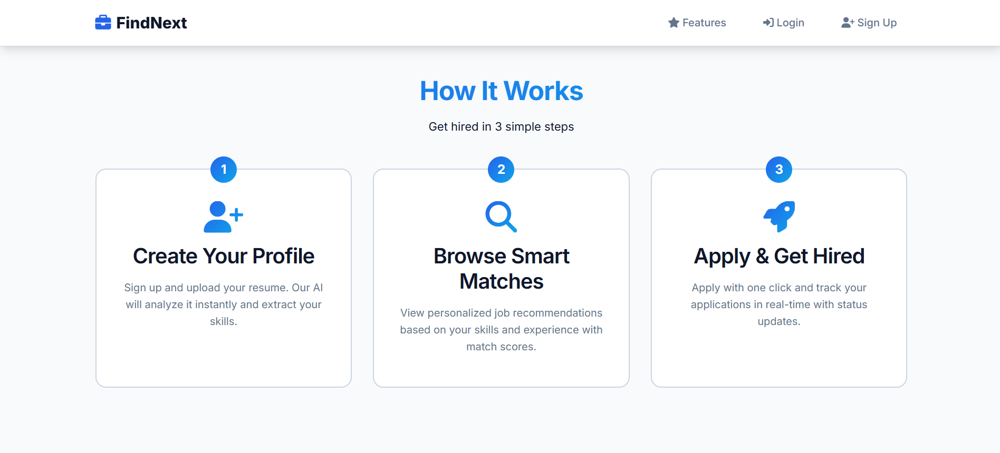
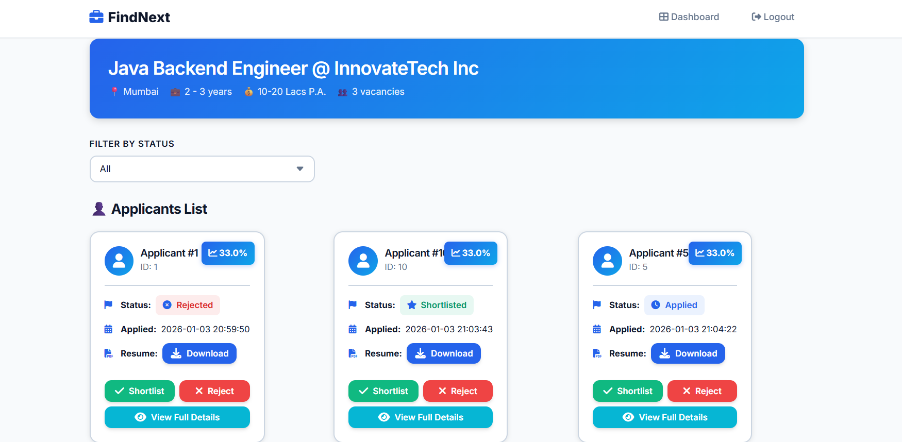
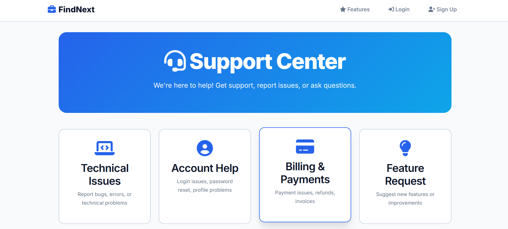
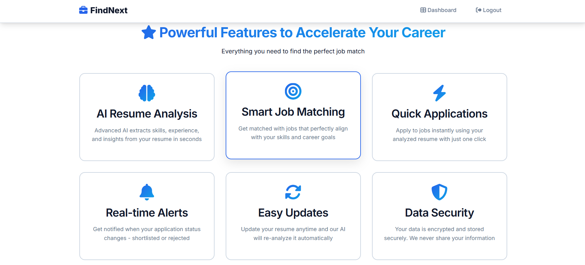

# FindNext - AI-Powered Job Recruitment Platform

<p align="center">
  
</p>

<p align="center">
    <a href="#-key-features">Key Features</a> •
    <a href="#-visual-walkthrough">Visual Tour</a> •
    <a href="#-tech-stack">Tech Stack</a> •
    <a href="#-installation--setup">Installation</a> •
    <a href="#-configuration">Configuration</a>
</p>

---

## 📖 Project Overview

**FindNext** is a comprehensive, full-stack recruitment web application built on the robust **Jakarta EE (Servlet/JSP)** architecture. It modernizes the hiring process by integrating **AI-driven resume analysis** to bridge the gap between talent and opportunity.

Unlike traditional job boards, FindNext parses candidate resumes to extract skills and experience, generating a **"Match Score"** that helps employers identify the perfect fit instantly. The platform features distinct ecosystems for Job Seekers, Employers, and Administrators, ensuring a seamless and secure experience for all users.

---

## 🚀 Key Features

### 🧠 Intelligent Core
* **AI Resume Parsing:** Automatically extracts technical skills, work history, and education from PDF resumes using the Affinda API.
* **Smart Match Scoring:** Algorithms calculate a percentage match (e.g., *33% match*) between a candidate's profile and job descriptions.
* **Real-Time Analytics:** Immediate feedback for users on application status changes.

### 👥 Role-Based Portals
* **Job Seeker Dashboard:** A personalized hub to manage profiles, track application statuses (Applied, Shortlisted, Rejected), and view job recommendations.
* **Employer Panel:** A powerful suite for posting jobs, managing active listings, and screening applicants with "Accept/Reject" workflows.
* **Admin Command Center:** Complete oversight capabilities to manage user bases, moderate content, and handle platform security (Block/Unblock users).

### 🛡️ Security & Support
* **Secure Authentication:** End-to-end encryption with Email OTP verification for sign-ups and password recovery.
* **Support Ticket System:** A tiered support mechanism allowing users to raise issues by priority (Low, Medium, High) with image attachments.

---

## 📸 Visual Walkthrough

### 1. The Workflow
*How FindNext connects talent to opportunity in three steps:*
<p align="center">
  
</p>

### 2. Job Seeker Experience
*Candidates get a clean interface to track their career progress.*

| **Login & Security** | **Job Seeker Dashboard** | **Application Status** |
| :---: | :---: | :---: |
|  |  |  |
| *Secure Entry with OTP* | *Personalized Job Feed* | *Track Shortlisted/Rejected Jobs* |

### 3. Employer & Admin Management
*Powerful tools for managing the hiring pipeline.*

| **Employer Dashboard** | **Applicant Screening** | **Admin Control Panel** |
| :---: | :---: | :---: |
|  |  |  |
| *Manage Active Listings* | *View Match Scores & Resume* | *User Management & Moderation* |

### 4. Support System
*Dedicated help center for user assistance.*

| **Help Center** | **Ticket Submission** | **Features Overview** |
| :---: | :---: | :---: |
|  |  |  |
| *Categorized Support* | *Detailed Issue Reporting* | *Core Capabilities* |

---

## 🛠 Tech Stack

The application follows the **MVC (Model-View-Controller)** design pattern.

* **Backend Logic:** Java (Jakarta Servlet API & JSP), JSTL
* **Server:** Apache Tomcat 10.1.x
* **Database:** MySQL (Relational Data Models)
* **Frontend:** HTML5, CSS3, JavaScript (Responsive Design)
* **Integrations:**
  * **Affinda API:** Resume Parsing & AI Analysis
  * **JavaMail API:** SMTP Email Notifications

---

## ⚙️ Installation & Setup

### Prerequisites
* Java Development Kit (JDK) 17+
* Apache Tomcat 10.1+
* MySQL Server

### Step 1: Clone the Repository
```bash
git clone https://github.com/your-username/FindNext.git
cd FindNext
```

### Step 2: Database Setup
```sql
mysql -u root -p
CREATE DATABASE findnext_db;
USE findnext_db;
SOURCE src/main/resources/db/schema.sql;
```

### Step 3: Environment Configuration
```properties
DB_URL=jdbc:mysql://localhost:3306/findnext_db
DB_USER=your_username
DB_PASSWORD=your_password
AFFINDA_API_KEY=your_api_key_here
MAIL_USERNAME=your_email@example.com
MAIL_PASSWORD=your_app_password
MAIL_FROM=no-reply@findnext.com
```

### Step 4: Build & Deploy
1. Export WAR file  
2. Copy `FindNext.war` to Tomcat `webapps`  
3. Start Tomcat  
4. Open `http://localhost:8080/FindNext/home`

---

## 📂 Source Structure

```text
FindNext/
├── src/main/java/
│   ├── com.findnext.controller
│   ├── com.findnext.dao
│   ├── com.findnext.model
│   └── com.findnext.util
│
├── src/main/webapp/
│   ├── assets/
│   ├── WEB-INF/
│   └── *.jsp
│
├── src/main/resources/
│   └── db/schema.sql
│
├── images/
└── README.md
```

---

## 👤 Author

**FindNext Development Team**  
*Built with passion for clean code and scalable Java web architecture.*
